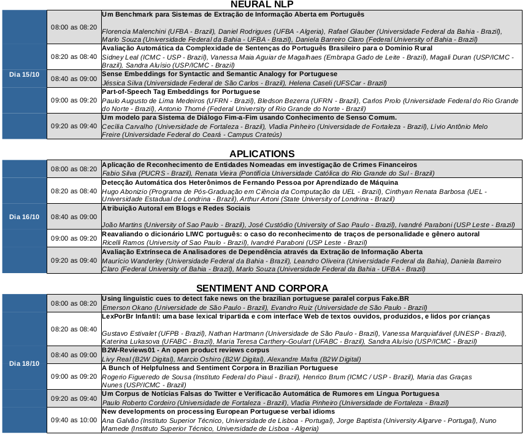

# General Program

 

# Detailed Program
**Poster and oral presentation instructions** : All STIL papers may be presented orally in Portuguese or English. We suggest that the oral presentation, slides and posters (for STIL, JDP and TILic) be in the same language chosen for paper submission. The oral presentation will last 19 minutes/paper (15 minutes for presentation and 4 minutes for questions and answers - Q&A).

Computers will be available in all rooms, so you can bring your presentation in a USB key or use your own computer, as you wish. In any case, though, please arrive at least 30 minutes before your session to allow enough time to copy/test your presentation.

For JDP presentations, please visit: [JDP Program](https://sites.google.com/view/jdp2019/)

For TILic Posters, please visit: [TILic Posters Model](https://sites.google.com/view/tilic2019/trabalhos-aceitos)

 

OBS. 1: For a better view download the general and detailed program below:

Download General Program (<a href="generalprogram-stil2019.pdf"><i>pdf</i></a>) (<a href="generalprogram.png"><i>png</i></a>)
 
Download Detailed Program (<a href="detailedprogram.pdf"><i>pdf</i></a>) (<a href="detailedprogram.png"><i>png</i></a>)
  
OBS. 2: For detailed JDP programming, please visit: [JDP Program](https://sites.google.com/view/jdp2019/)
