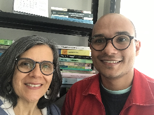

# Invited Speaker and Tutorial
___
### 
Invited Speaker

___
### _Profa. Dra. Maria José Bocorny Finatto_

**Title**: _A History of Research: Textual and Terminological Accessibility in Public Utility Texts in Brazil_

**Bio**: M.J.B. Finatto is a Professor of Linguistics at the Department of Linguistics and Philology (UFRGS), and a Brazilian Research Fellow with CNPq. She completed her first postdoctoral research in Natural Language Processing and Readability Assessment at the Institute for Mathematical and Computational Sciences –ICMC, of the Inter-institutional Center for Research and Development in Computational Linguistics – NILC, at the University of São Paulo, in 2011. She completed her second postdoctoral research at the University of Évora, in 2017, with the project Historical Corpora of Portuguese. Finatto has a PhD in Language Studies, Linguistics, Terminology and Terminography (2001). She holds a M.A. in Linguistics and Lexicography (1993) and a B.A. in Languages and Literature – Portuguese and German (1991). Her research interests involve Natural Language Processing, Corpus Linguistics, Descriptive Terminology, Lexicography, Lexicology, Translation, Text and Discourse Studies and Scientific Communication to the General Public.

**Abstract**: The aim of this presentation is to present an overview of the scenario of Applied Linguistics and Terminology research in Brazil. These investigations, to a certain extent, connect with the issue of accessibility of written information for the general public, especially adults with limited education. In our analysis of the national scenario, we will be looking at the history of the research group “Textual and Terminological Accessibility” (ATT). Since 2011, graduate-level researchers in our group have been working on multiple perspectives in this area, in the line of research “Lexicography, Terminology and Translation” at the Universidade Federal do Rio Grande do Sul. We have drawn insights from a number of areas, including ATT, through which we rely heavily on computer technology, as well as Corpus Linguistics and Natural Language Processing. We seek to analyze texts, discourses, terminologies, lexicon and writing conventions from different areas, under the perspective of intralingual translation. Our efforts have been carried out to support actions that may facilitate the understanding of public utility information, especially in the areas of Health care and Law. (Sponsors/Grants: CNPq / CAPES / FAPERGS / SEAD-UFRGS)

___
### 
Tutorial

___

### _Profa. Dra. Renata Vieira_ and _MSc. Joaquim Santos_ 

**Title**: _Modelos de Linguagem (Word Embeddings)_

**Bio**: Renata Vieira possui título de PhD em Informática pela University of Edinburgh (1998). É professora da PUC-RS onde atua em pesquisa e ensino na área de inteligência computacional, com ênfase em processamento de linguagem natural, representação do conhecimento, ontologias, agentes e web semântica. Renata coordena o Núcleo de Inteligência Artificial da Escola Politécnica, coordena o Laboratório de Pesquisa em Processamento de Linguagem Natural e é líder do Grupo de Pesquisa do CNPq, nessa área. Possui experiência em coordenação de projetos inter-institucionais e internacionais, e participa em diversos comitês de programa de eventos científicos nacionais e internacionais (STIL, BRACIS, PROPOR, LREC, FLAIRS, FOIS, IJCAI, ACL). Participou da criação da Comissão Especial de PLN da Sociedade Brasileira de Computação, sendo a primeira presidente dessa comissão de 2007 a 2009. Com bolsa de Pesquisador Visitante Sênior CAPES-Fulbright visitou a Universidade do Texas em Austin em 2007. Participou no comitê executivo da Association for Computational Linguistics de 2011 a 2013. Em 2017 realizou estágio pós doutoral na Universidade de Toulouse. Recebeu em duas edições consecutivas prêmio de melhor artigo no Simpósio Brasileiro de Tecnologia da Informação e Linguagem Humana. É atualmente indicada pela SBC como Conferencista Senior na área de Procesamento de Linguagem Natural.

**Bio**: Joaquim Santos é Licenciado em Matemática pela Universidade Regional do Cariri (URCA) e atualmente é aluno de mestrado em Ciência da Computação na Pontifícia Universidade Católica do Rio Grande do Sul (PUCRS), sob orientação da Profa. Dr. Renata Vieira. Sua principal área de estudos é o Processamento de Linguagem Natural com ênfase no Português Brasileiro. Tem realizados pesquisas sobre Modelos de Linguagem clássicos e mais recentes (como BERT e Flair Embeddings) e os aplicado no Reconhecimento de Entidades Nomeadas para o Português, como retrata seu trabalho mais recente: "Assessing the Impact of Contextual Embeddings for Portuguese Named Entity Recognition". Seus principais temas de interesse são Redes Neurais, Modelos de Linguagem, Extração de Relações e Reconhecimento de Entidades Nomeadas.

**Abstract**: Recent work in the area of Natural Language Processing has been impacted by sophisticated Language Models, known as Word Embeddings. Such language models capture information from the context in which the words appear and also from the characters they are composed by. In this tutorial we will talk about the evolution of these language models, how they are generated and used. We will also talk about evaluation questions of these models and their main limitations. We will also introduce some of the current Portuguese language models that are available for free use.